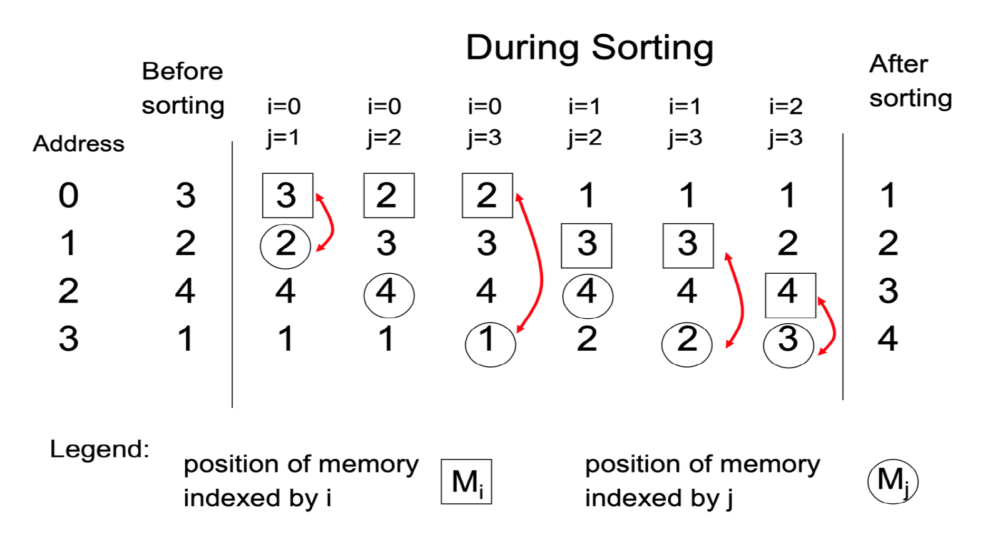
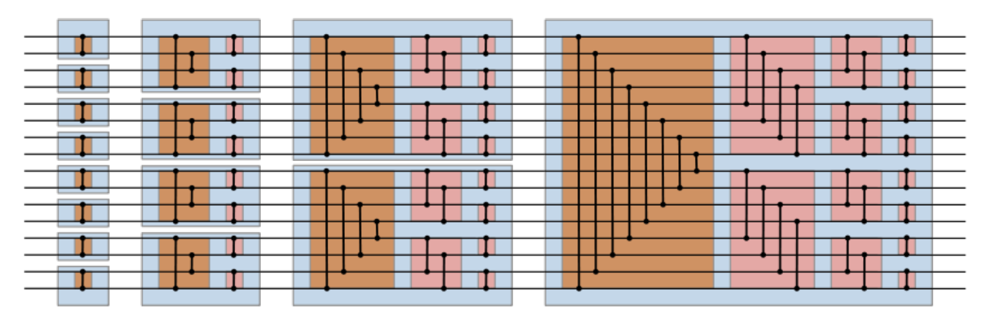

# ECE 524L Fall 2021
**California State University, Northridge**  
**Department of Electrical and Computer Engineering**  

## Lab 9 - Pipelining, Performance and Structural Modeling 

## Objective

After completing this lab, students will be able to:
- Exercise parallel processing on FPGA
- Use FPGA resources efficiently
- Pipeline a design efficiently

## Requirements

The following material is required to complete the lab:
- Xilinx Vivado 2019.1

## References

- Xilinx FPGA datasheets (available at http://www.xilinx.com)
- Software Manual (available at http://www.support.xilinx.com)
- VHDL reference guide (available at http://www.acc-eda.com/vhdlref)
- Wikipedia (http://en.wikipedia.org/wiki/Bitonic_sorter)

## Introduction

Sorting algorithms have always been of interest to computer scientist. There are many software algorithms for software implementation but this focuses on hardware implementation of sorting process. 

Figure 8.1 shows the primitive sorting process that uses two comparators to compare two values. Using this algorithm every possible pair of the input data should be compared. Figure 9.1 assumes there are only 4 data values to be sorted but your hardware should be designed to sort 16 data values. This is an open ended design problem which leaves the details of the implementation to the students. The only constraint here, is to follow the recommended sorting process and the fact that this is a sequential process which means there is only one comparator available and a pair of registers.

Figure 9.1	Primitive sorting algorithm process to sort four values

Figure 9.2 shows the parallel bitonic sorting algorithm implementation for 16 numbers. 

Figure 9.2 Bitonic sorter dataflow using sorters (comparators) to sort 16 values  

## Prelab

:point_right: **Prelab Task 1:** Preparing .COE file with initial values.
:point_right: **Prelab Task 2:** Apply the parallel sorting algorithms on an example with 16 data values and show how it works.
:point_right: **Prelab Task 3:** Write pseudocode for your designs.

## Procedure

:point_right: **Task 1:** Implement the sorter hardware for Figure 9.1. You can assume data values are initially stored in Block RAM. Initialize your block RAM using .COE file. You can assume data values are 8 bits wide unsigned numbers.

:point_right: **Task 2:** Implement a structural modeling of sorter shown in Figure 8.2 using VHDL generate statement. Your design should be optimized for performance. This means every comparator should be registered or your whole design should be fully pipelined.

:point_right: **Task 3:** Simulate your designs to show the correct functionality for each case.

:point_right: **Task 4:** To simplify the process, you can assume that data values can be originally applied in your testbench but eventually you have to use block RAMs to store values before and after sorting.

:point_right: **Task 5:** Measure area and performance for each case.

:point_right: **Task 6:** Discuss your results in terms of area, performance and latency.

:point_right: **Task 7:** Discuss if this design can be solved for a general case for any number of inputs.
